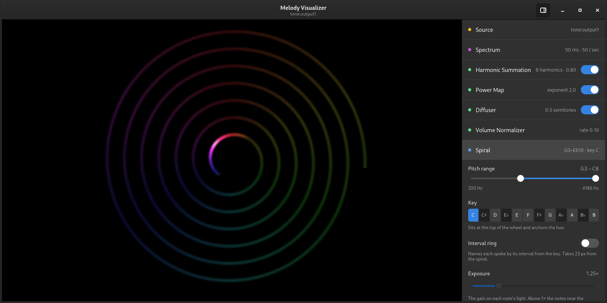

# Melody Visualizer

A real-time music visualizer for Linux. It listens to a JACK audio port and
draws the pitches it hears on a spiral, one turn per octave.



## Why a spiral

A spectrum analyser draws frequency on a straight line, so the same note in two
octaves lands in two unrelated places, and the overtones of one note look like
more notes. Musicians do not hear pitch that way: a C is a C in every octave.

On the spiral, every turn is an octave, so all the Cs sit on one spoke. The
key you choose sits at the top, and a note's hue shows its interval from the
key. A melody moves round the wheel, and a chord lights a shape. Before drawing, the app scores each
frequency by its whole harmonic series, which lets the fundamental of a note
stand out over its overtones.

The control panel at the right shows the pipeline, one stage per row: the
input port, the spectrum analysis, each transform, and the spiral. Click a row
to open its controls. The settings are saved to
`~/.local/state/melody-visualizer/config.toml`.

## Platform support

The app is tested only on Debian-based systems (Debian and Ubuntu) for now. It
needs GTK 4.10 or later, so Debian 13 or Ubuntu 23.04 or later. Other Linux
distributions with GTK 4.10 and a JACK server may work too.

## Dependencies

- A stable Rust toolchain that supports edition 2024 (Rust 1.92 or later),
  for example from [rustup](https://rustup.rs/).
- GTK 4 (4.10 or later) and JACK development headers, and a C toolchain:

  ```bash
  sudo apt install build-essential clang libgtk-4-dev libjack-jackd2-dev
  ```

- A JACK server at run time. On a desktop with PipeWire, install its JACK
  support; otherwise install `jackd2`:

  ```bash
  sudo apt install pipewire-jack pipewire-bin   # PipeWire desktops
  sudo apt install jackd2                       # standalone JACK
  ```

- Optional: the [Playfair Display](https://fonts.google.com/specimen/Playfair+Display)
  font. The spiral's interval ring draws its labels in it, and cairo finds it
  through fontconfig. Put the font files in `~/.local/share/fonts` and run
  `fc-cache`. Without the font, fontconfig uses its default face, which on a
  stock Ubuntu is DejaVu Sans.

## Running

The app does not start a JACK server itself. Start the app under a running
server, then pick an input port in the **Source** row of the control panel.

On a PipeWire desktop, run it through `pw-jack`:

```bash
pw-jack cargo run --release
```

With standalone JACK, start `jackd` first, then:

```bash
cargo run --release
```

To visualize an audio file on a PipeWire desktop, play it into the app. The
script builds and starts the app itself, so close any window that is already
open first. You hear the track and see it at the same time:

```bash
scripts/play-file.sh ~/music/track.flac
```

## Development

[DEVELOPMENT.md](DEVELOPMENT.md) covers the tests, benchmarks, style guide, and
how to run the app with no display or audio hardware.
[ARCHITECTURE.md](ARCHITECTURE.md) describes the components and threads.
